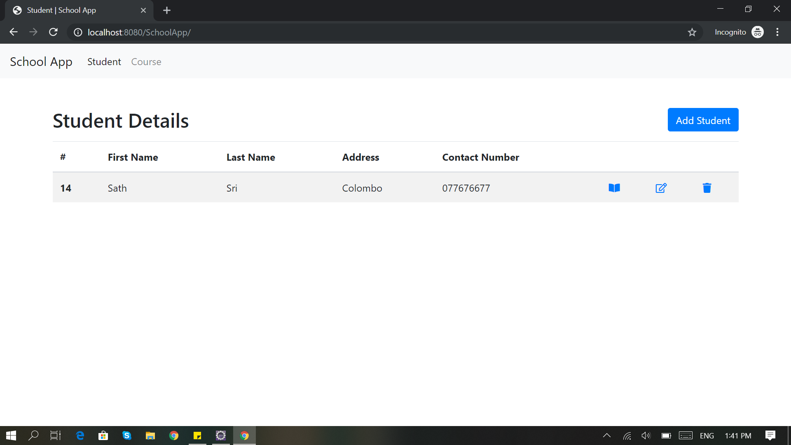
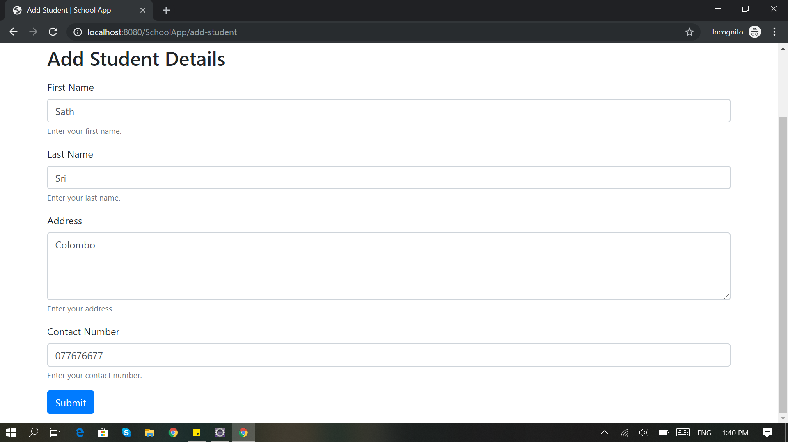
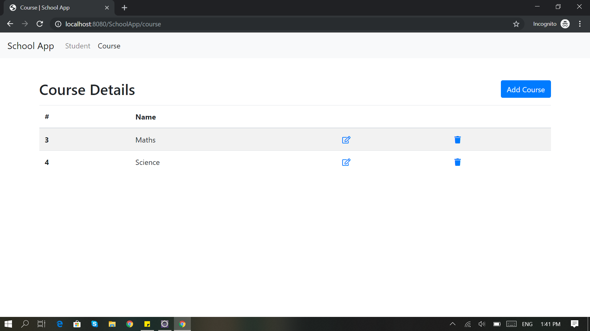
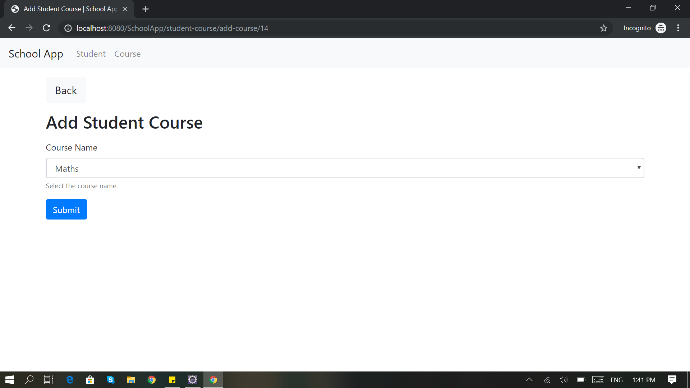
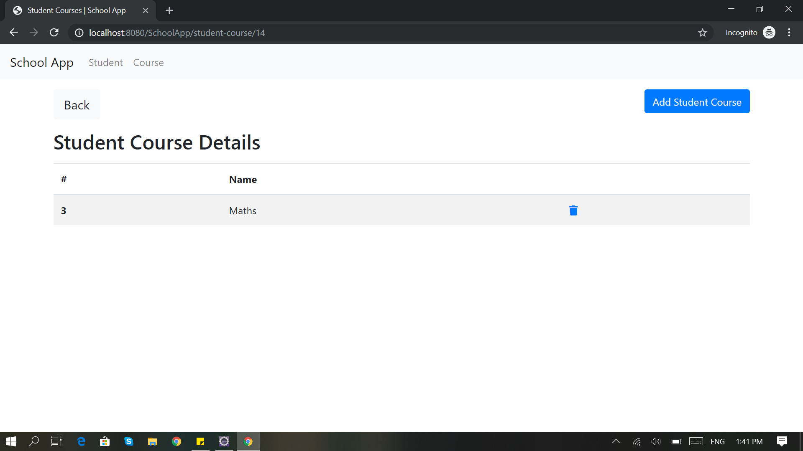

# SCHOOL APP - SPRING MVC

```
Develop the sample web application for managed students and courses of University using SPRING MVC.
```

## Method

> First, clone or download the source code from github

> Then, import the `my_school_db.sql` script to MySQL 

> Then, go to the `spring-servlet.xml`, change your database configuration

```
<bean id="dataSource" class="org.springframework.jdbc.datasource.DriverManagerDataSource">
	<property name="driverClassName" value="com.mysql.jdbc.Driver" />
	<property name="url" value="jdbc:mysql://localhost:3306/my_school_db" />
	<property name="username" value="root" />
	<property name="password" value="" />
</bean>
```

> Finally, run the application on `Apache Tomcat Server` :+1:.

## Screenshots










